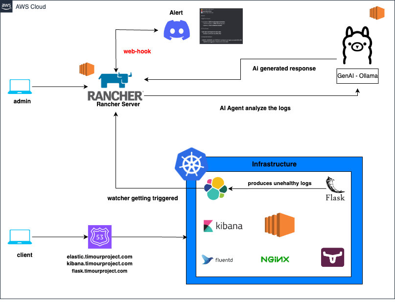
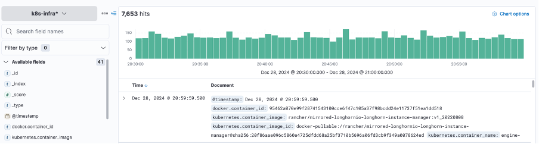
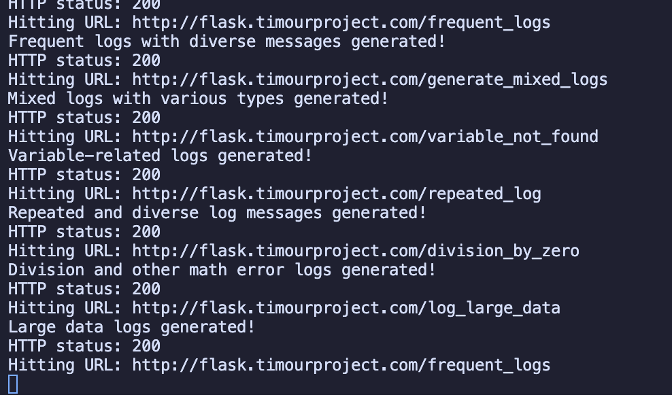
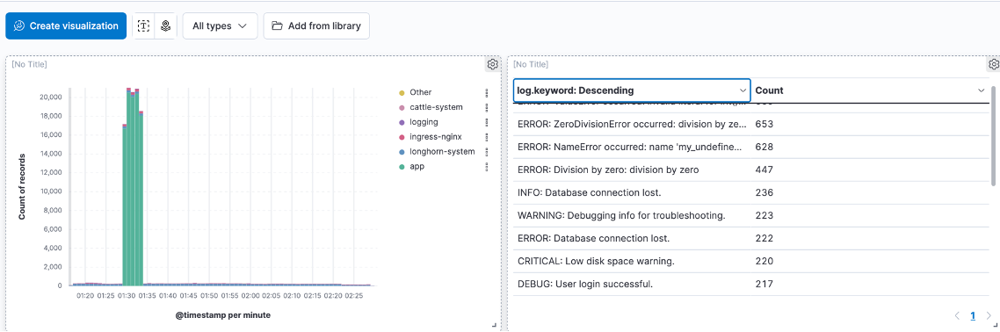
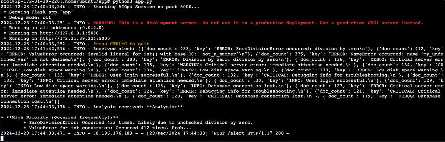
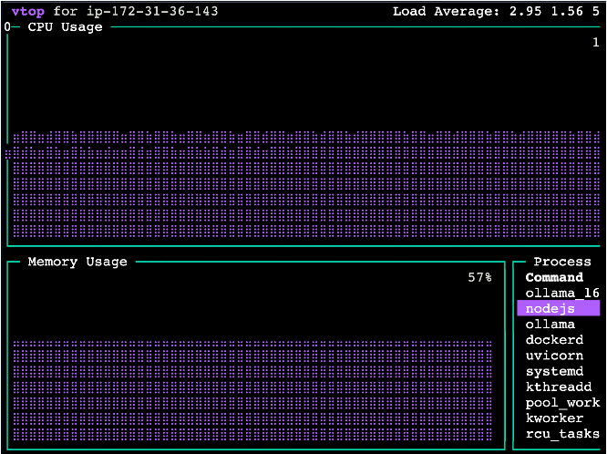
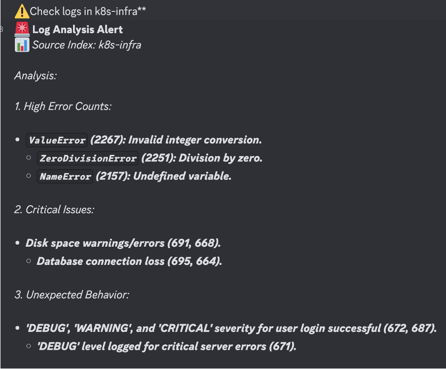
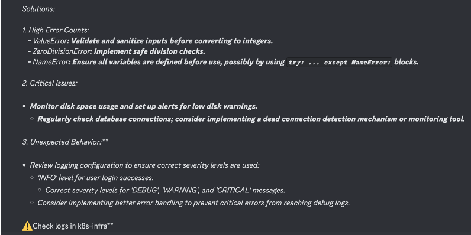

# AI-Driven Log Analysis & Cost Optimization Platform

## Project Overview

Built a practical demonstration of an AI-powered log management system that simulates and handles real-world operational scenarios.

### Core Features

- Simulated application generating various log patterns:
  - Error cascades
  - Security incident patterns
  - Resource usage spikes
  - System anomalies
- AI-powered real-time log analysis using Ollama/Mistral
- Automated Discord alerts with AI-generated solutions
- Proactive cost management through early pattern detection

### Use Case Example

The system monitors a test application that intentionally generates problematic log patterns. When specific thresholds are exceeded:

1. Elasticsearch detects the pattern
2. AI model analyzes the log context
3. Discord receives detailed alerts with:
   - Issue description
   - Potential impact
   - Recommended fixes
   - Prevention strategies

## Technologies Used

- Rancher for Kubernetes cluster management
- Elasticsearch for log aggregation
- Kibana for visualization
- FluentD for log collection ( logstash optional)
- Kubernetes (managed via Rancher)
- Longhorn for persistent Elasticsearch storage
- Ollama with Mistral/Llama models for AI analysis
- Discord for notifications
- Python Flask for the API service

## Benefits

- Reduced storage costs through early detection
- Automated incident response
- AI-driven problem resolution
- Proactive system maintenance

## Results & Outcomes

lets spam some suspicous logs....

the outcome:

Server gets a request

Ollama AI is running

Alert comes to Discord

